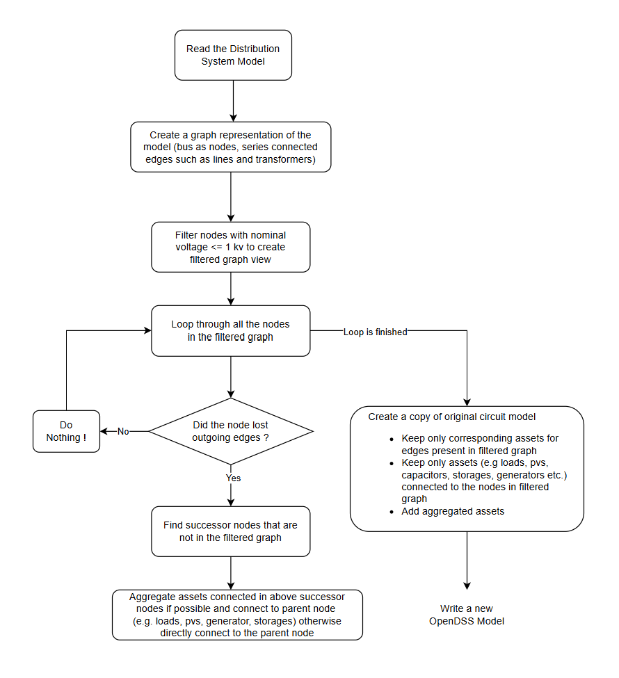
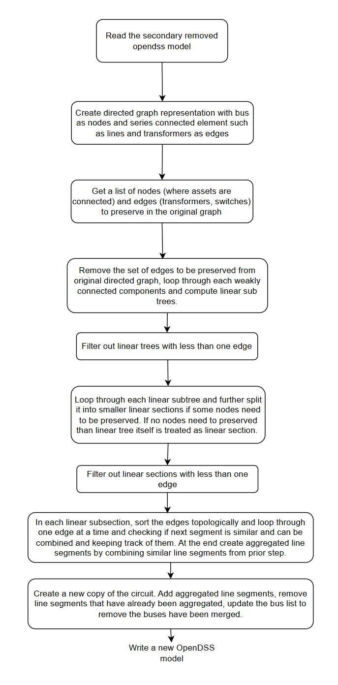

## Feeder Reduction Approach

We reduce and obfuscate a given distribution system model (OpenDSS format) in four steps.

1. Strip the secondary but keep aggregated loads and generation to a parent node.

    Here is a flowchart describing this process.
    

2. Once all secondary circuit is removed and assets are aggregated then we move to aggregating primary networks. In this process we lump together similar line segments while preserving nodes with important assets connected to it (e.g. loads, capacitors, pvs, generators, storages, switches).
    Here is a flowchart explaining this process.
    
3. Rename all the buses in incremental order starting from 0 (source node). Lines are renamed as `line_{bus1}_{bus2}` where bus1 and bus2 are from and to bus. Similarly transformers are renamed as `transformer_{bus1}_{bus2}`. Loads are renamed as `load_{bus1}` and other point assets are renamed in similar way.

4. Finally we remove all the coordinate information from buses except for buses where switches are connected. Differential privacy algorithm is used to add noise to preserved bus coordinates (for switches) so they can not be identified in google maps but still maintain reasonable topological structure.
